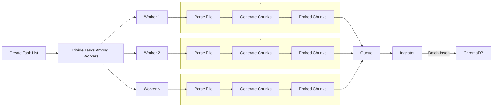

# RunIQ 🤖

I used to be a competitive cross-country runner with accesss to resources such as coaches and physical trainers. Now, as someone who still loves to run every day, I often find myself wishing for that guidance when I am unsure to progress or when I get injured. <br><br> The inspiration for this project was quite simple: I wanted a quick, reliable way to get advice regarding cross-country training and injury recovery. To solve this, I built `RunIQ` - a personal, RAG-powered running coach and general knowledge bot.<br>

> **Important Note**: The data processed by this project is copyrighted and I am not at liberty to distribute it. This repository is intended for personal use and demonstration under fair use. However, the pipelines are fully configurable - if you understand the configuration structures, you can create your own configs to process and embed content from publicly available sources.
> <br>

## Key Features & Approach ⚡️

### Ingestion Pipeline
The ingestion pipeline processes a list of  XML sitemapts to extract all relevant download links from each site. Once the links are collected, the corresponding HTML pages are downloaded and saved locally. 

<br>

### Embedding Pipeline
The entry point to this pipeline generates and distributes a task list across a pool of worker processes. Each worker is responsible for handling a subset of the previously downloaded HTML content end to end.
Once a worker receives its respsective task list, it will parse the HTML into JSON, store the JSON for intermediate persistence, process the JSON into chunks, embed the chunks, and forward the embedded chunks to an ``Ingestor`` to be batch inserted into ChromaDB.

This distributed design enables higher throughput for large datasets, while the intermediate JSON storage makes it incredibly easy to test differnt chunking strategies or to swap out embedding models. 

#### Diagram


<br>

### RAG CLI
The Retrieval-Augmented Generation (RAG) CLI is a streamlined interface that allows for interactive querying against the embedded dataset. At its core, it includes a  *Retriever*, which embeds users queries and fetches relevant context, and a *Generator*, which uses the context to create a response.

Beyond these core components, two additional classes make RunIQ's system capable of having multi-turn conversations: the *ConversationBuffer* and the *QueryRephraser*.

Each ``query + response`` pair is saved to the *ConversationBuffer*, which maintains recent dialogue history and produces a rolling summary of the conversation so far. The *QueryRephraser* is then able to restructure user queries to include context provided by the summary.

> The ConversationBuffer & QueryRephraser follow the same logic as LangChain's ``ConversationSummaryMemory``, but were re-implemented for greater flexibility and learning value.


#### Diagram
  ```mermaid
flowchart LR
    A[User Input Query] --> Z{Is query 'quit'?}
    Z -- Yes --> X[Exit CLI]
    Z -- No --> B[Process Query]
    B --> qCheck{Is context empty?}
    qCheck -- Yes --> C[Embed Query]
    qCheck -- No --> C1[Rephrase Query]
    C1 --> C
    
    C --> D[Retrieve Context]
    D --> E[Generate Response]
    E --> F[Save Turn to Buffer]
    F --> G[Summarize Recent Turns]
    G --> A
```

<br>

### Validation
In order to ensure high quality retrieval, the system was tested against a labeled dataset and meassured using precision-at-k. This framework was used to test five different embedding models, each with 21 chunker hyperparameter variations. The final combination of chunking strategy and embedding model was selected based on highest performing average precision-at-k. 

#### Validation Results 

| Model            | Chunk Size |  Chunk Overlap  |   Chunk Strategy    | P@1 | P@5 | P@10 | MAP@1 | MAP@5 | MAP@10 |
| :--------------- | :--------- | :-------------: | :-----------------: | :-: | :-: | :--: | ----- | ----- | ------ |
| bge-base-en-v1.5 | 256        | 50 (20 percent) | Naive (token-based) | .86 | .79 | .71  | .86   | .84   | .84    |

> _Note:_ The above shows *only* is the optimal model + scheme based on my experiments.

<br>

## Example Interaction (RAG CLI) 🧠

#### Query:

What are foam rollers used for?

#### Response:

The purpose of foam rollers for runners is primarily to provide a self-massage that helps ease muscle tightness and stiffness after a workout. This process temporarily improves range of motion and provides a feel-good effect. However, it's essential to note that foam rolling does not physically alter the muscle tissue or break up scar tissues in a short period, as some people might believe. Instead, it changes the way your brain experiences these sensations during the recovery process, leading to relaxation of tight spots in muscles.

---

#### Query:

Are they good for relieving soreness?

#### Response:

Yes, foam rollers can help alleviate muscle soreness after exercise. This is primarily due to their ability to improve circulation and reduce muscle tension, rather than physically altering the muscle tissue as some people may believe. Foam rolling before a run can also help prepare your muscles for optimal performance by loosening them up, elevating breathing and heart rate, and psychologically preparing you for exercise. Additionally, foam rolling after a workout can relieve excess tension and stimulate the release of neurotransmitters that boost relaxation, potentially reducing feelings of fatigue and improving recovery. However, it's important to remember that foam rollers may lose their effectiveness over time and that harder surfaces are generally better, but new users might want to start with a softer, non-textured roller.

> _Note_: The responses shown above are trimmed for brevity. The actual output can include more detailed, step-by-step explanations where applicable.

<br>

## Future Considerations 🔮

- **Automating Ingestion**: Schedule regular updates or new data sources with minimal manual intervention.
- **Larger Labeled Dataset**: Expand retrieval validation efforts by using an LLM to generate a larger labeled dataset.
- **Fine Tuning**: Enhance the validation dataset(s) to include distractor documents so that a local open source model can be tuned (RAFT).
