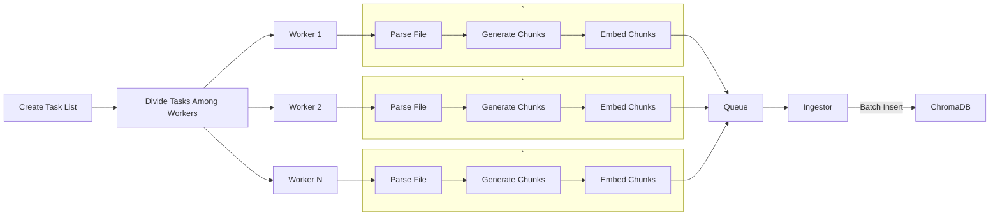

# RunIQ 🤖

I used to be a competitive cross-country runner with accesss to resources such as coaches and physical trainers. Now, as someone who still loves to run every day, I often find myself wishing for that guidance when I am unsure to progress or when I get injured. <br><br> The inspiration for this project was quite simple: I wanted a quick, reliable way to get advice regarding cross-country training and injury recovery. To solve this, I built `RunIQ` - a personal, RAG-powered running coach and general knowledge bot.<br>

> **Important Note**: The data processed by this project is copyrighted and I am not at liberty to distribute it. This repository is intended for personal use and demonstration under fair use. However, the pipelines are fully configurable - if you understand the configuration structures, you can create your own configs to process and embed content from publicly available sources.
> <br>

## Key Features & Approach ⚡️

### Ingestion Pipeline
- _Site Map Processing_: Parses XML sitemaps to collect all desired download links.
- _HTML Downloading_: Downloads raw HTML files and saves them to disk for futher processing.

### Embedding Pipeline
- _Intermediate Processing_: Converts raw HTML into structured JSON representations.
- _Chunking_: Splits text into semantically meaningful chunks for embedding.
- _Embedding_: Generates vector embeddings from text chunks using the `bge-base-en-v1.5` model.

#### Diagram

    
### RAG CLI
  - _Retriever_: Embeds the user query and fetches relevant context.
  - _Generator_: Creates a response based on retriever context.
  - _ConversationBuffer_: Maintains a rolling summary of recent conversation turns.
  - _QueryRephraser_: Rephrases the user query relative to the conversation summary.


#### Diagram
  ```mermaid
flowchart LR
    A[User Input Query] --> Z{Is query 'quit'?}
    Z -- Yes --> X[Exit CLI]
    Z -- No --> B[Process Query]
    B --> qCheck{Is context empty?}
    qCheck -- Yes --> C[Embed Query]
    qCheck -- No --> C1[Rephrase Query]
    C1 --> C
    
    C --> D[Retrieve Context]
    D --> E[Generate Response]
    E --> F[Save Turn to Buffer]
    F --> G[Summarize Recent Turns]
    G --> A
```

### Extensibility
  - Intermediary storage of HTML and JSON allows for the exploration of different chunk schemes and embedding models.
  - Adjust or test different chunking schemes without re-downloading data.
  - Config-driven processing enables easy addition of new sources

### Validation
  - Retrieval performance evaluated using a labeled dataset and precision-at-k.
  - Tested 5 embedding models, each with 21 hyperparameter variations for chunking.
  - Optimal model + chunking combination selected based on retrieval performance.

<br>

## Validation Results 📝

| Model            | Chunk Size |  Chunk Overlap  |   Chunk Strategy    | P@1 | P@5 | P@10 | MAP@1 | MAP@5 | MAP@10 |
| :--------------- | :--------- | :-------------: | :-----------------: | :-: | :-: | :--: | ----- | ----- | ------ |
| bge-base-en-v1.5 | 256        | 50 (20 percent) | Naive (token-based) | .86 | .79 | .71  | .86   | .84   | .84    |

> _Note:_ This is the optimal model + scheme based on my experiments.

<br>

## Example Interaction (RAG CLI) 🧠

#### Query:

What are foam rollers used for?

#### Response:

The purpose of foam rollers for runners is primarily to provide a self-massage that helps ease muscle tightness and stiffness after a workout. This process temporarily improves range of motion and provides a feel-good effect. However, it's essential to note that foam rolling does not physically alter the muscle tissue or break up scar tissues in a short period, as some people might believe. Instead, it changes the way your brain experiences these sensations during the recovery process, leading to relaxation of tight spots in muscles.

---

#### Query:

Are they good for relieving soreness?

#### Response:

Yes, foam rollers can help alleviate muscle soreness after exercise. This is primarily due to their ability to improve circulation and reduce muscle tension, rather than physically altering the muscle tissue as some people may believe. Foam rolling before a run can also help prepare your muscles for optimal performance by loosening them up, elevating breathing and heart rate, and psychologically preparing you for exercise. Additionally, foam rolling after a workout can relieve excess tension and stimulate the release of neurotransmitters that boost relaxation, potentially reducing feelings of fatigue and improving recovery. However, it's important to remember that foam rollers may lose their effectiveness over time and that harder surfaces are generally better, but new users might want to start with a softer, non-textured roller.

> _Note_: The responses shown above are trimmed for brevity. The actual output can include more detailed, step-by-step explanations where applicable.

<br>

## Future Considerations 🔮

- **Automating Ingestion**: Schedule regular updates or new data sources with minimal manual intervention.
